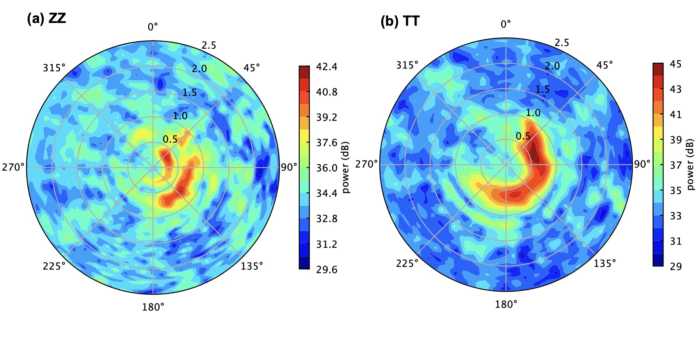
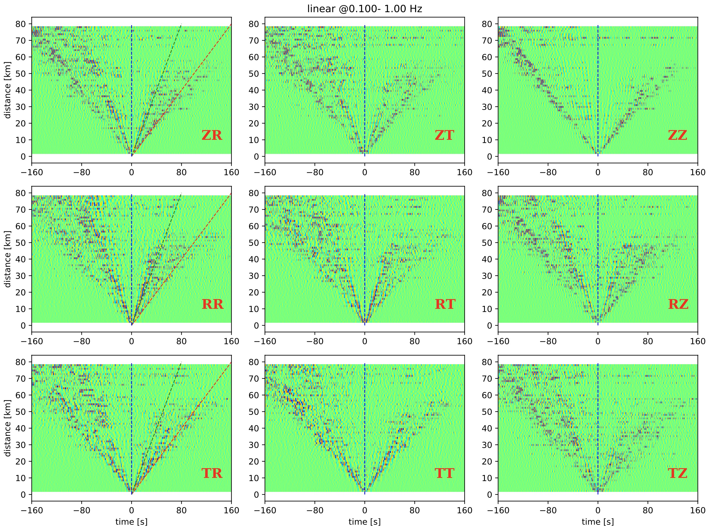
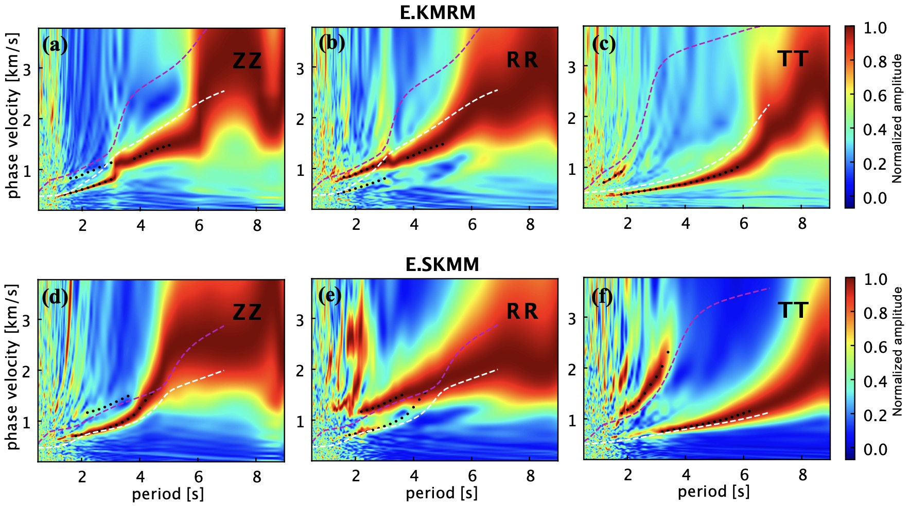
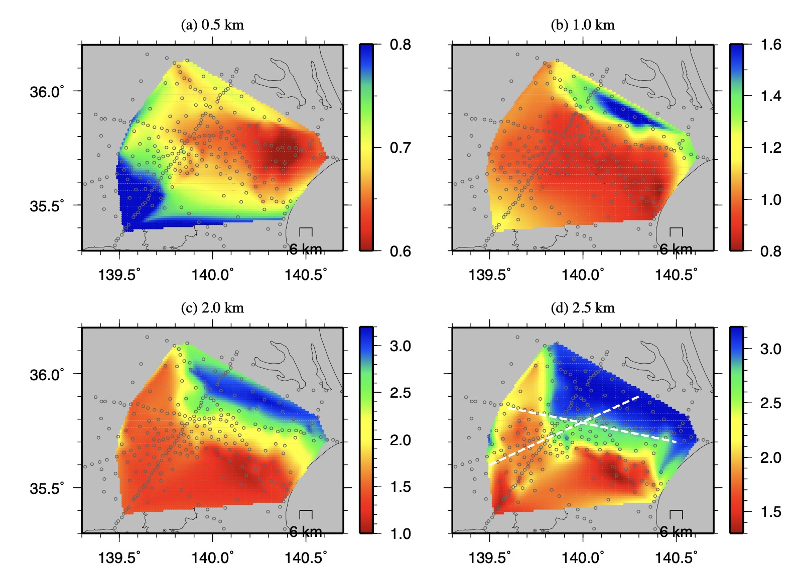
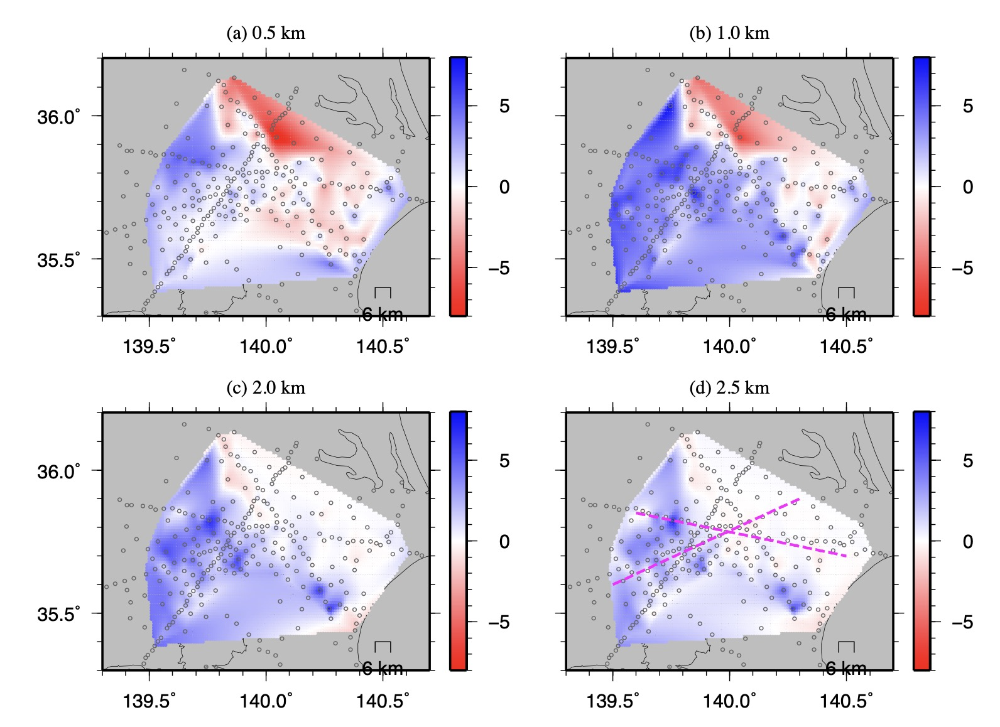

# Scripts to reproduce several important figures for Jiang & Denolle, 2022 (submitted to JGR). 
This respo contains some python/shell scripts to reproduce several important figures for Jiang & Denolle, 2022. The scripts require the cross-correlation functions and/or the velocity model derived by Jiang & Denolle, 2022. Both files are achieved at [Zenos](URL) and are publically accessible. Detailed description, usage and input files for each script are provided below. 

Contact Chengxin Jiang (chengxin.jiang1@anu.edu.au) if you have any questions or any bugs to report.  

## script of xxx
* Description: 
* Inputs: 
* Usage:

## script of figure4\_moveout\_matrix.py
* Description: a python script to reproduce the moveout plot for figure 4
* Inputs: the cross correlation functions between all MeSO-net stations
* Usage: python figure4\_moveout\_matrix.py

## script of xxx
* Description:
* Usage:
* Inputs:

## script of figure10\_plot\_iso.csh
* Description:
* Inputs: station list; 3D velocity model (model\_Kanto\_0.01inc.dat); output file name
* Usage: csh figure10\_plot\_iso.csh model\_Kanto\_0.01inc.dat

## script of figure12\_plot\_aniso.csh
* Description:
* Inputs: station list; 3D velocity model (model\_Kanto\_0.01inc.dat); output file name
* Usage: csh figure12\_plot\_aniso.csh model\_Kanto\_0.01inc.dat

